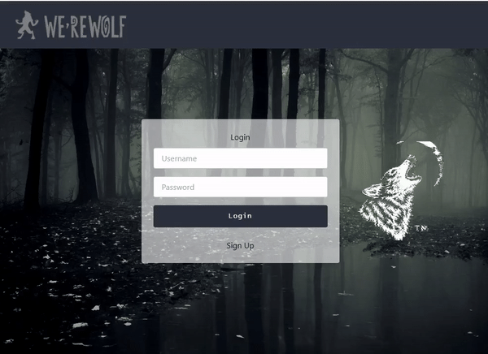
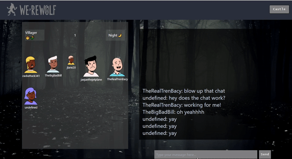

<!-- This is a [Next.js](https://nextjs.org/) project bootstrapped with [`create-next-app`](https://github.com/vercel/next.js/tree/canary/packages/create-next-app). -->


## Tech Stack


Welcome to We'reWolf!

An age-old rivalry, come to life! Join your friends in a spooky yet elegant struggle to find the furry menaces ravaging your village. Be careful though -- you may be shocked to find your friends are actually the culprits!


## Getting Started
### Installation


Once you've cloned this repo, navigate into the root directory, and install all of the necessary dependencies:


```
npm install

```

Once all node module dependencies have been installed, initialize a server and compiler to open the app:

```

npm run dev

```

Open [http://localhost:3000](http://localhost:3000) with your browser to see the result.
## About The Game

### Objective:
  - **For the Villagers, Doctor, and Seer:** Identify and vote out the Werewolves to save the village.

  - **For the Werewolves:** Eliminate all Villagers and other opposing roles.
### Roles:
  - **Werewolves:** Typically, there are 2 or more players who are designated as Werewolves. They work together to eliminate other players during the game. The Werewolves know each others identity and can communicate secretly to plan their strategy.
  - **Villagers:** The majority of players are Villagers. They do not have any special abilities other than trying to identify and vote out the Werewolves during the game.


  <!-- - **Doctor:** The Doctor is a special role on the side of the Villagers. The Doctor has the ability to protect one player each night from being eliminated by the Werewolves. The Doctors goal is to save as many Villagers as possible.
  - **Seer:** The Seer is another special role on the side of the Villagers. The Seer has the ability to investigate one players identity each night to determine if they are a Villager or a Werewolf. The Seers goal is to gather information and use it to help the Villagers identify the Werewolves. -->

### GamePlay:
  1. The game is played in rounds, with each round consisting of two phases: Day and Night.
  2. During the Day phase, all players, including the Villagers, Doctor, and Seer, openly discuss and vote on who they think is a Werewolf. Players can use their observations, deductions, and any special abilities they may have to make their case.

  3. At the end of the Day phase, the player with the most votes against them is dead and eliminated from the game. If there is a tie, no one is dead.
  4. During the Night phase, the Werewolves secretly choose a player to eliminate from the game. The Doctor can choose a player to protect, and the Seer can investigate a players identity.

  5. The next Day phase begins, and the cycle continues until either all Werewolves are eliminated, or the Werewolves outnumber the Villagers.

  6. The game continues until one of the win conditions is met: either the Werewolves are all eliminated, or the Werewolves outnumber the Villagers.

## Features


  ### Login
  

  ### Game Lobby
  


  ### Game Page
  

  ### Game Page with tombstone
  ### End Page?


## Authors

  1. [Ben Tracy](https://www.linkedin.com/in/bentracydotcom/) <a href="https://github.com/popeshaq">
 
 </a>

  2. [Jae Hoon Lee](https://www.linkedin.com/in/jae-hoon-lee/) <a href="https://github.com/jl924">
 
 </a>


  3. [James Carrington](https://www.linkedin.com/in/james-carrington-jdc/) <a href="https://github.com/Chordata88">
 
 </a>

  4. [Justen Lane](https://www.linkedin.com/in/justenlane/) <a href="https://github.com/Jlane20">
 
 </a>


  5. [William Miller](https://www.linkedin.com/in/willcmiller/) <a href="https://github.com/millerw4">
 
 </a>

  6. [Zack Freeman](https://www.linkedin.com/in/zackfreeman/) <a href="https://github.com/zfreeman341">
 
 </a>
